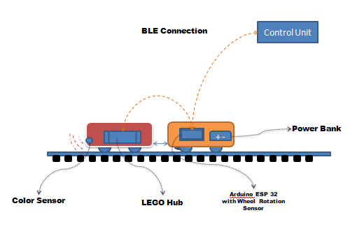

# ESP32 LEGO Train Controller v3.0 - With Rotation Sensor

A sophisticated wireless train control system that bridges LEGO Powered Up trains with precise rotation sensor feedback for autonomous movement control.



## 🚀 Features

### **Advanced Train Control**
- **Wireless BLE Communication** - Control trains remotely via laptop/PC
- **Precision Distance Control** - Move exact distances using rotation sensor feedback
- **Dual Control Modes** - Sensor-based precision or time-based estimation
- **Real-time Monitoring** - Live speed, distance, and RPM tracking
- **Emergency Stop System** - Multiple safety mechanisms for instant stopping

### **Smart Sensor Integration**
- **Rotation Sensor** - Precise wheel rotation detection (Pin 2)
- **Live Data Streaming** - 200ms real-time sensor updates
- **Distance Tracking** - Accurate distance measurement independent of motor commands
- **Speed Monitoring** - Actual train speed vs commanded speed comparison

### **Professional GUI Interface**
- **Tabbed Interface** - Organized control sections
- **Progress Tracking** - Real-time movement progress with visual indicators
- **Statistics Dashboard** - Estimated vs actual movement comparison
- **LED Control** - Both ESP32 RGB and LEGO Hub LED management
- **Connection Monitoring** - Automatic reconnection and health status

## 📋 System Requirements

### **Hardware Requirements**
- **ESP32 Development Board** (Arduino Nano ESP32 recommended)
- **LEGO Powered Up Train** with compatible hub
- **Rotation Sensor** (optical or magnetic encoder)
- **Power Bank** for portable operation
- **Color Sensor** (optional, for track detection)

### **Software Requirements**
- **Arduino IDE** 1.8.19+ or 2.x
- **Python** 3.7+ (for GUI controller)
- **Windows/Linux/macOS** (for laptop controller)

### **Library Dependencies**
```
NimBLE: 1.4.3 (recommended - required for Legoino compatibility)
Legoino: 1.1.0 (latest stable)
Arduino ESP32 Core: 2.0.18 (stable and tested)
```

> ⚠️ **Important**: NimBLE 1.4.3 is specifically recommended as Legoino depends on it for stable operation.

## 📁 Project Structure

```
04_esp32_train_control_speed_sensor/
├── arduino_esp32_bridge/
│   └── arduino_esp32_bridge.ino      # Main ESP32 firmware
├── esp32_code_bkp/
│   └── esp32_code.ino                 # Additional ESP32 code backup
├── release/
│   └── LEGO-Train-Controller-v2.0.exe # Ready-to-use GUI executable
├── train_hub_emulator/
│   └── train_hub_emulator.ino         # Hub emulator (optional testing)
├── advanced_controller.py             # Main Python GUI application
├── build_exe.bat                      # Script to build executable
├── controller.py                      # Alternative controller interface to test connection
└── diagram.pptx                       # System architecture diagram
```

### **File Descriptions**

#### **Core Components**
- **`arduino_esp32_bridge/arduino_esp32_bridge.ino`** - Main ESP32 firmware with rotation sensor integration, BLE server, and LEGO hub communication
- **`advanced_controller.py`** - Primary Python GUI application with tabbed interface, real-time monitoring, and comprehensive train control

#### **Release & Build**
- **`release/LEGO-Train-Controller-v2.0.exe`** - Pre-compiled executable (no Python installation required)
- **`build_exe.bat`** - Batch script to build executable using PyInstaller

#### **Development & Testing**
- **`train_hub_emulator/train_hub_emulator.ino`** - LEGO hub emulator for testing without physical hardware
- **`esp32_code_bkp/esp32_code.ino`** - Additional backup of ESP32 firmware
- **`arduino_esp32_bridge/esp32_code.bkp`** - Backup within main folder
- **`controller.py`** - Alternative/simplified controller interface(NOT REQUIRED)

#### **Documentation**
- **`diagram.pptx`** - System architecture and connection diagrams
- **`README.md`** - This comprehensive documentation

## 🛠️ Installation & Setup

### **Step 1: ESP32 Firmware Setup**

1. **Install Arduino IDE** (2.x recommended)
   - Download from [Arduino.cc](https://www.arduino.cc/en/software)

2. **Add ESP32 Board Support**:
   ```
   File → Preferences → Additional Boards Manager URLs:
   https://raw.githubusercontent.com/espressif/arduino-esp32/gh-pages/package_esp32_index.json
   ```

3. **Install Required Libraries**:
   ```
   Tools → Manage Libraries → Search and Install:
   - NimBLE-Arduino (version 1.4.3)
   - Legoino (version 1.1.0)
   ```

4. **Board Configuration**:
   ```
   Board: "ESP32 Dev Module" or "Arduino Nano ESP32"
   CPU Frequency: 240MHz
   Flash Size: 4MB
   Partition Scheme: Default 4MB with spiffs
   Upload Speed: 921600
   Core Debug Level: None
   ```

5. **Upload Firmware**:
   - Open `04_esp32_train_control_speed_sensor/arduino_esp32_bridge/arduino_esp32_bridge.ino`
   - Select your ESP32 port
   - Verify and Upload

### **Step 2: Hardware Connections**

#### **ESP32 Pin Configuration**
```
Pin 2  → Rotation Sensor (interrupt-capable)
Pin 14 → RGB LED Red
Pin 15 → RGB LED Blue  
Pin 16 → RGB LED Green
GND    → Common Ground
3.3V   → Sensor Power (if required)
```

#### **Rotation Sensor Setup**
- **Wheel Radius**: 8.25mm (configurable in code)
- **Encoder Type**: 2 holes per rotation
- **Detection**: 4 sensor changes per full wheel rotation
- **Connection**: Digital input with internal pull-up resistor
- **Mounting**: Secure to train wheel or axle

#### **System Connections Diagram**
```
[Laptop/PC] ←--BLE--> [ESP32] ←--BLE--> [LEGO Hub] → [Train Motor]
                        ↓
                   [Rotation Sensor] → [Train Wheel]
                        ↓
                   [Power Bank] (optional)
```

### **Step 3: Controller Setup**

#### **Option A: Use Pre-built Executable (Recommended)**
1. Navigate to `04_esp32_train_control_speed_sensor/release/` folder
2. Double-click `LEGO-Train-Controller-v2.0.exe`
3. No Python installation required!

#### **Option B: Run Python Script**
1. **Install Python Dependencies**:
   ```bash
   pip install bleak tkinter asyncio threading datetime json time
   ```

2. **Run Controller**:
   ```bash
   cd 04_esp32_train_control_speed_sensor
   python advanced_controller.py
   ```

#### **Option C: Build Your Own Executable**
1. **Install PyInstaller**:
   ```bash
   pip install pyinstaller
   ```

2. **Run Build Script**:
   ```bash
   cd 04_esp32_train_control_speed_sensor
   build_exe.bat
   ```

3. **Executable Location**: Created in `release/` folder

## 🎮 Usage Guide

### **Initial Connection Procedure**

1. **Power On ESP32** - RGB LED will show red blinking (disconnected)
2. **Power On LEGO Hub** - Press center button until LED shows
3. **Open Controller** - Run executable or Python script
4. **Scan for Devices**:
   - Click "🔍 Scan for ESP32" button
   - Wait for scan completion (10 seconds)
5. **Select ESP32**:
   - Choose "ESP32-LEGO-Train" from device list
   - Click "🔗 Connect"
6. **Hub Auto-Connection** - ESP32 will automatically connect to LEGO hub
7. **Verify Connection** - Check status indicators

### **LED Status Indicators**

| ESP32 RGB LED | Status | Description |
|---------------|--------|-------------|
| 🔴 Slow Blink (1s) | Disconnected | ESP32 not connected to laptop |
| 🔵 Medium Blink (0.5s) | Partial Connection | ESP32 OR Hub connected (not both) |
| 🟢 Solid Green | Fully Connected & Stopped | All systems connected, train stopped |
| 🟡 Solid Yellow | Moving | Train in motion |
| 🔴 Fast Blink (0.15s) | Emergency Stop | Emergency stop activated |

### **GUI Interface Overview**

#### **🔗 Connection Tab**
- Device scanning and selection
- Connection status monitoring
- BLE device management

#### **🚂 Basic Control Tab**
- Speed slider (-100 to +100)
- Quick control buttons (Stop, Reverse, Forward, Full Forward)
- Speed adjustment buttons (±10, ±20)
- Current status display with real-time sensor data
- Emergency stop controls

#### **⚙️ Advanced Tab**
- **Timed Movement**: Run for specific duration
- **Distance Movement**: Move exact distances using sensor feedback
- **Movement Statistics**: Estimated vs actual comparison
- **Progress Tracking**: Visual progress bars

#### **🎯 Rotation Sensor Tab**
- Real-time sensor data display
- Sensor control buttons
- Live status indicators
- Sensor calibration information

#### **💡 LED Control Tab**
- ESP32 RGB LED control
- LEGO Hub LED control
- Color selection and effects

#### **📊 Status Tab**
- Comprehensive system status
- Auto-refresh controls
- Hub management functions
- Detailed diagnostics

#### **📝 Log Tab**
- Real-time communication log
- Error tracking
- Debug information
- Log export functionality

### **Control Modes Explained**

#### **Basic Motor Control**
```
Speed Range: -100 (full reverse) to +100 (full forward)
Resolution: 1 unit increments
Response Time: ~50ms
```

#### **Timed Movement**
```
Duration Range: 1-300 seconds
Purpose: Run for exact time duration
Feedback: Shows actual distance traveled during time period
Use Case: Calibration and consistent timing
```

#### **Distance Movement**
```
Distance Range: 1-1000 cm
Precision: ±0.5cm (sensor mode)
Control Modes:
  - Sensor Feedback: Uses rotation sensor for precision
  - Time Estimation: Uses speed×time calculation (fallback)
```

### **Emergency Controls**

#### **Emergency Stop Triggers**
- Red emergency button (bottom left)
- Duplicate emergency button in Basic Control
- Connection timeout (15 seconds)
- System error conditions

#### **Emergency Stop Behavior**
- Immediate motor stop
- Movement command lock
- Visual indicators (fast red LED blink)
- Prevents new movements until cleared

#### **Clearing Emergency**
- Click "✅ Clear Emergency" button
- Use "Clear Emergency" in status section
- System automatically resumes normal operation

### **Real-time Monitoring**

#### **Sensor Data Display**
- **Distance Traveled**: Cumulative distance from sensor (cm)
- **Current Speed**: Actual wheel speed (cm/s)
- **Wheel RPM**: Rotation speed measurement
- **Live Indicator**: Connection status (🟢 Live, 🟡 Timeout, 🔴 Disconnected)

#### **Movement Progress**
- **Timed Movements**: Progress bar with elapsed/total time
- **Distance Movements**: Progress bar with traveled/target distance
- **Real-time Updates**: 2-second refresh interval during movement

#### **Statistics Tracking**
- **Estimated Distance**: Based on speed×time calculations
- **Actual Distance**: From rotation sensor
- **Difference**: Accuracy comparison
- **Total Time**: Cumulative movement time
- **Max Speed**: Highest speed used
- **Total Movements**: Movement counter

## 📊 Command Reference

### **BLE Communication Protocol**

#### **Service and Characteristic UUIDs**
```
Service UUID: 12345678-1234-1234-1234-123456789abc
Characteristic UUID: 87654321-4321-4321-4321-cba987654321
```

#### **Motor Control Commands**
```
MOTOR_SPEED_<-100 to 100>     # Direct speed control
Examples:
  MOTOR_SPEED_0               # Stop
  MOTOR_SPEED_50              # Half speed forward
  MOTOR_SPEED_-75             # 3/4 speed reverse
  MOTOR_SPEED_100             # Full speed forward
```

#### **Movement Commands**
```
MOVE_TIME_<milliseconds>_SPEED_<speed>
Examples:
  MOVE_TIME_5000_SPEED_60     # Move at speed 60 for 5 seconds
  MOVE_TIME_10000_SPEED_-40   # Move at speed -40 for 10 seconds

MOVE_DISTANCE_<cm>_SPEED_<speed>
Examples:
  MOVE_DISTANCE_50_SPEED_40   # Move 50cm at speed 40
  MOVE_DISTANCE_100_SPEED_-60 # Move 100cm at speed -60 (reverse)
```

#### **Safety Commands**
```
EMERGENCY_STOP                # Immediate stop + movement lock
CLEAR_EMERGENCY              # Resume normal operation
INIT_SYSTEM                  # Initialize/reset system state
```

#### **Sensor Commands**
```
GET_SENSOR_DATA              # Request current sensor readings
RESET_SENSOR                 # Zero distance counter
SENSOR_ENABLE                # Enable sensor functionality
SENSOR_DISABLE               # Disable sensor functionality
DEBUG_DISTANCE              # Debug distance calculations
```

#### **System Commands**
```
GET_STATUS                   # Full system status
GET_DETAILED_STATUS          # Comprehensive status with all parameters
GET_BATTERY                  # Hub battery level
PING                        # Connection test (responds with PONG)
RESET_STATS                 # Clear movement statistics
```

#### **Distance Mode Commands**
```
TOGGLE_DISTANCE_MODE         # Switch between sensor/time mode
GET_DISTANCE_MODE           # Query current distance control mode
```

#### **LED Control Commands**
```
ESP32_LED_<COLOR>           # ESP32 RGB LED control
Colors: RED, GREEN, BLUE, YELLOW, PURPLE, CYAN, WHITE, OFF, BLINK, AUTO

HUB_LED_<COLOR>            # LEGO Hub LED control
Colors: RED, GREEN, BLUE, YELLOW, PURPLE, WHITE, OFF
```

#### **Hub Management Commands**
```
DISCONNECT_HUB              # Safely disconnect from LEGO hub
RECONNECT_HUB              # Attempt hub reconnection
FORCE_HUB_CHECK            # Check hub connection status
```

### **Response Message Formats**

#### **Status Responses**
```
STATUS:HUB:C,BATTERY:85,MOTOR_SPEED:50,MOVING:Y,SENSOR_DISTANCE:123.45...
SENSOR_LIVE:DISTANCE:123.45,SPEED:12.3,RPM:45.6
BATTERY_UPDATE:85
EMERGENCY_STOP_EXECUTED
```

#### **Movement Progress**
```
TIMED_PROGRESS:ELAPSED:2.5,TOTAL:5.0,PROGRESS:50.0,DISTANCE:25.3
DISTANCE_PROGRESS:TRAVELED:25.0,REMAINING:25.0,TARGET:50.0,PROGRESS:50.0
TIMED_COMPLETED:PLANNED:5000,ACTUAL:5005,DISTANCE:52.3,SPEED:50
DISTANCE_COMPLETED:TARGET:50.0,ACTUAL:49.8,ERROR:0.2,TIME:3456
```

#### **Error Responses**
```
ERROR:HUB_NOT_CONNECTED
ERROR:EMERGENCY_STOP_ACTIVE
ERROR:INVALID_SPEED
ERROR:INVALID_DISTANCE_OR_SPEED
```

## 🔧 Advanced Configuration

### **Sensor Calibration**

#### **Wheel Configuration in ESP32 Code**
```cpp
// Modify these constants for your specific setup:
const float WHEEL_RADIUS = 0.00825;     // Wheel radius in meters (8.25mm)
const int NO_OF_HOLES = 2;              // Holes in encoder wheel
const int SENSOR_CHANGES_PER_ROTATION = 2 * NO_OF_HOLES; // 4 changes per rotation

// Distance calculation formula:
// Distance = (2 * π * radius * 100) * (interrupts / changes_per_rotation)
```

#### **Calibration Procedure**
1. Measure actual wheel radius accurately
2. Count encoder holes/marks per rotation
3. Update constants in code
4. Test with known distance
5. Fine-tune if necessary

### **Performance Tuning**

#### **Update Rates (ESP32)**
```cpp
Sensor Data Update: 50ms     (20 Hz) - updateSensorData()
BLE Transmission: 200ms      (5 Hz)  - sendSensorDataToLaptop()
Status Updates: 10000ms      (0.1 Hz) - Periodic status logging
Movement Timeout: 600000ms   (10 min) - Safety timeout for distance movements
```

#### **GUI Refresh Rates (Python)**
```python
GUI Fast Update: 100ms       (10 Hz)  - Sensor display updates
Auto Status Refresh: 5000ms  (0.2 Hz) - Full status request
Connection Monitor: 3000ms   (0.33 Hz) - Connection health check
Progress Updates: 2000ms     (0.5 Hz)  - Movement progress display
```

#### **Connection Parameters**
```cpp
Ping Interval: 5 seconds     - Keep-alive heartbeat
Connection Timeout: 15 seconds - Disconnect detection
Reconnection Attempts: Automatic - Built-in retry logic
```

### **Distance Control Modes**

#### **Sensor Feedback Mode (Recommended)**
```
Accuracy: ±0.5cm
Method: Real-time rotation counting
Advantages:
  - Precise distance control
  - Compensates for speed variations
  - Independent of motor commands
  - Accounts for wheel slippage
```

#### **Time Estimation Mode (Fallback)**
```
Accuracy: ±5-10cm (depends on calibration)
Method: Speed × Time calculation
Calibration Factor: 0.3 cm/s per speed unit
Usage: When sensor unavailable or disabled
```

### **Safety Configuration**

#### **Emergency Stop Settings**
```cpp
// Timeouts and safety limits
Movement Timeout: 10 minutes maximum
Connection Timeout: 15 seconds
Emergency LED Blink: 150ms fast blink
Manual LED Timeout: 10 seconds
```

#### **Movement Limits**
```cpp
Speed Range: -100 to +100
Distance Range: 1 to 1000 cm
Time Range: 100ms to 300000ms (5 minutes)
Distance Tolerance: 0.5cm
```

## 🔍 Troubleshooting

### **Connection Issues**

#### **ESP32 Not Found During Scan**
**Symptoms**: No devices found or ESP32 not in list
**Solutions**:
- Verify ESP32 is powered and programmed with correct firmware
- Check if BLE is enabled on computer
- Ensure ESP32 is not connected to another device
- Try scanning multiple times (BLE discovery can be intermittent)
- Restart ESP32 and try again
- Check serial monitor for ESP32 startup messages

#### **BLE Connection Fails**
**Symptoms**: "Connection failed" error or timeout
**Solutions**:
- Reduce distance between ESP32 and computer
- Restart Bluetooth service on computer
- Clear Bluetooth cache (Windows: Device Manager → Bluetooth → Remove device)
- Check for interference from other BLE devices
- Verify ESP32 serial output shows "BLE ADVERTISING STARTED"

#### **Hub Connection Failed**
**Symptoms**: ESP32 connected but "LEGO Hub: Disconnected"
**Solutions**:
- Turn LEGO hub off and on (hold center button)
- Check hub battery level (low battery affects BLE)
- Ensure hub is in pairing mode (center button LED should be white/blinking)
- Use "Force Hub Check" button in GUI
- Check distance between ESP32 and hub (max ~10 meters)
- Restart ESP32 to reset hub connection state

### **Sensor Issues**

#### **Sensor Not Responding**
**Symptoms**: Distance always shows 0.0, RPM always 0.0
**Solutions**:
- Verify rotation sensor connection to Pin 2
- Check sensor power supply (3.3V if required)
- Ensure encoder wheel/disc is properly aligned
- Test sensor with multimeter (should change state with rotation)
- Check for loose connections or broken wires
- Use "Debug Distance" command to check sensor state

#### **Inaccurate Distance Measurements**
**Symptoms**: Actual distance doesn't match commanded distance
**Solutions**:
- Calibrate wheel radius in ESP32 code
- Verify encoder hole count matches code configuration
- Check for wheel slippage on track
- Ensure sensor is detecting all encoder changes
- Test on straight track without obstacles
- Compare with manual measurement over known distance

#### **Intermittent Sensor Data**
**Symptoms**: Live indicator shows timeouts, inconsistent readings
**Solutions**:
- Check sensor mounting stability
- Verify clean encoder disc (no dirt/obstruction)
- Ensure adequate sensor sensitivity
- Check for electromagnetic interference
- Verify stable power supply to ESP32
- Consider shielded cables for sensor connections

### **Movement Issues**

#### **Train Doesn't Move**
**Symptoms**: Motor speed commands sent but no movement
**Solutions**:
- Check if emergency stop is active (clear it)
- Verify hub battery level
- Ensure motor is properly connected to hub
- Check track for obstructions
- Test with basic speed commands first
- Verify hub port configuration in code

#### **Movement Stops Prematurely**
**Symptoms**: Distance movements stop before reaching target
**Solutions**:
- Check sensor calibration accuracy
- Verify stable sensor readings during movement
- Look for obstacles causing wheel blockage
- Check for loose encoder wheel
- Increase distance tolerance in code if needed
- Use timed movement as alternative test

#### **Inconsistent Movement Distance**
**Symptoms**: Same command produces different distances
**Solutions**:
- Check for wheel slippage on track
- Verify consistent battery voltage
- Ensure stable sensor mounting
- Check for track irregularities
- Consider surface traction issues
- Test on different track sections

### **Performance Issues**

#### **Slow GUI Response**
**Symptoms**: Delayed button responses, laggy interface
**Solutions**:
- Check BLE signal strength (RSSI value)
- Reduce distance between devices
- Close other BLE applications
- Restart controller application
- Check computer Bluetooth driver updates
- Monitor CPU usage during operation

#### **Connection Drops/Timeouts**
**Symptoms**: Frequent disconnections, timeout warnings
**Solutions**:
- Improve signal strength (reduce distance/obstacles)
- Check for 2.4GHz interference (WiFi, microwaves)
- Verify stable power to ESP32
- Update computer Bluetooth drivers
- Use shorter cables/better connections
- Monitor ESP32 serial output for errors

#### **Sensor Data Timeouts**
**Symptoms**: "🟡 Timeout" or "🔴 No Data" indicators
**Solutions**:
- Verify sensor physical connection
- Check ESP32 power stability
- Ensure encoder wheel rotates freely
- Test sensor manually by rotating wheel
- Check for code conflicts with other interrupts
- Monitor serial output for sensor debug info

### **Software Issues**

#### **Python Dependencies Missing**
**Symptoms**: Import errors when running Python script
**Solutions**:
```bash
pip install --upgrade bleak
pip install --upgrade tkinter
pip install --upgrade asyncio
```

#### **Arduino Compilation Errors**
**Symptoms**: Code won't compile or upload
**Solutions**:
- Verify library versions (NimBLE 1.4.3, Legoino 1.1.0)
- Check board selection (ESP32 Dev Module)
- Update Arduino ESP32 core to 2.0.18
- Clear Arduino cache: File → Preferences → Clear
- Restart Arduino IDE

#### **Executable Won't Run**
**Symptoms**: .exe file fails to start or crashes
**Solutions**:
- Run as administrator
- Check Windows Defender/antivirus exclusions
- Verify all dependencies included in build
- Run from command line to see error messages
- Rebuild executable with latest Python/PyInstaller

## 📈 Development Guide

### **Code Architecture Overview**

#### **ESP32 Firmware Structure**
```cpp
// Main components:
setup()                     // System initialization
loop()                      // Main execution loop
rotationSensorISR()         // Interrupt service routine
updateSensorData()          // Sensor calculations
processCommand()            // BLE command handling
updateLEDStatus()           // Status indicators
```

#### **Python Controller Structure**
```python
# Main components:
EnhancedTrainController     # Main application class
setup_gui()                 # GUI initialization
notification_handler()     # BLE data processing
parse_esp32_response()      # Message parsing
update_gui_status()         # Interface updates
```

### **Adding New Features**

#### **Adding ESP32 Commands**
1. **Add command parsing** in `processCommand()`:
```cpp
else if (command == "NEW_COMMAND") {
    // Command implementation
    response = "COMMAND_EXECUTED";
}
```

2. **Add response handling** in Python:
```python
elif message.startswith("COMMAND_EXECUTED"):
    # Handle response
    self.log_message("New command executed", "INFO")
```

#### **Adding GUI Elements**
1. **Create new tab** in `setup_gui()`:
```python
def create_new_tab(self):
    new_tab = ttk.Frame(self.notebook)
    self.notebook.add(new_tab, text="🆕 New Feature")
    # Add controls and layouts
```

2. **Add control functions**:
```python
def new_feature_function(self):
    self.send_command("NEW_COMMAND")
```

#### **Adding Sensor Types**
1. **Modify sensor configuration**:
```cpp
#define NEW_SENSOR_PIN 4
// Add to setup()
pinMode(NEW_SENSOR_PIN, INPUT);
```

2. **Add sensor reading** in main loop:
```cpp
// In loop()
if (millis() - lastNewSensorRead > 100) {
    newSensorValue = digitalRead(NEW_SENSOR_PIN);
    lastNewSensorRead = millis();
}
```

### **Testing Procedures**

#### **Unit Testing**
- **Sensor Functionality**: Test rotation detection manually
- **BLE Communication**: Verify command/response cycle
- **Motor Control**: Test all speed ranges
- **Emergency Stops**: Verify safety mechanisms

#### **Integration Testing**
- **End-to-End Movement**: Test complete movement cycles
- **Connection Recovery**: Test disconnect/reconnect scenarios
- **Multiple Commands**: Test command queuing and processing
- **Error Conditions**: Test timeout and error handling

#### **Performance Testing**
- **Response Times**: Measure command execution latency
- **Data Throughput**: Monitor BLE data transfer rates
- **Battery Life**: Test power consumption
- **Range Testing**: Test maximum BLE range

### **Building and Distribution**

#### **Creating Executable**
```bash
# Install dependencies
pip install pyinstaller

# Build with all dependencies
pyinstaller --onefile --windowed --icon=app.ico advanced_controller.py

# Or use the provided script
build_exe.bat
```

#### **Version Management**
1. **Update version numbers** in:
   - ESP32 code comments
   - Python GUI title
   - README.md
   - Executable metadata

2. **Create release package**:
   - Compiled executable
   - Arduino code
   - Documentation
   - Example configurations

### **Code Quality Guidelines**

#### **ESP32 Code Standards**
- Use descriptive variable names
- Comment all sensor calculations
- Include error handling for all BLE operations
- Use consistent formatting and indentation
- Add debug output for troubleshooting

#### **Python Code Standards**
- Follow PEP 8 style guidelines
- Use type hints where appropriate
- Add error handling for all BLE operations
- Include logging for all major operations
- Organize code into logical functions/classes
  
### **Common Resources**
- **Arduino ESP32 Documentation**: [ESP32 Arduino Core](https://docs.espressif.com/projects/arduino-esp32/)
- **Legoino Library**: [GitHub Repository](https://github.com/corneliusmunz/legoino)
- **NimBLE Documentation**: [Arduino Library](https://github.com/h2zero/NimBLE-Arduino)
- **Python BLE**: [Bleak Documentation](https://bleak.readthedocs.io/)


**Project Location**: `04_esp32_train_control_speed_sensor/`

**Version**: 3.0

**This project is made for TU Braunschweig IfEV Institute**
